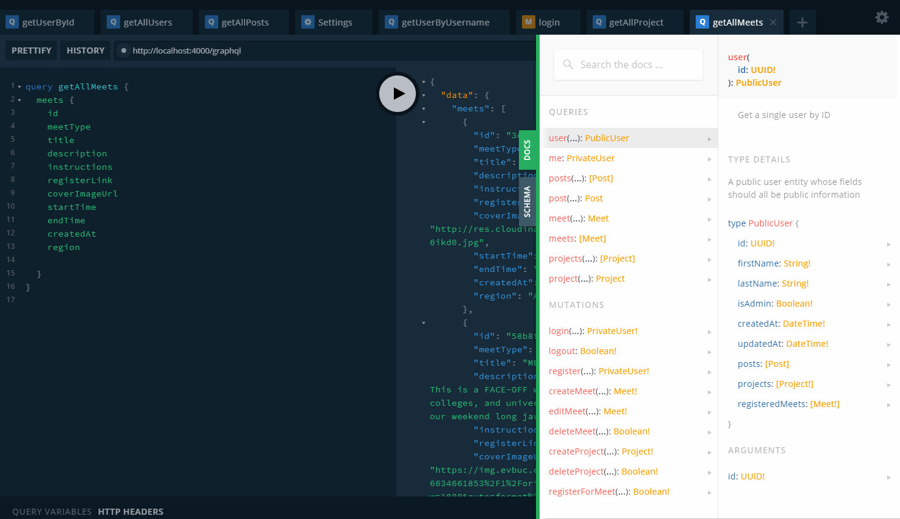
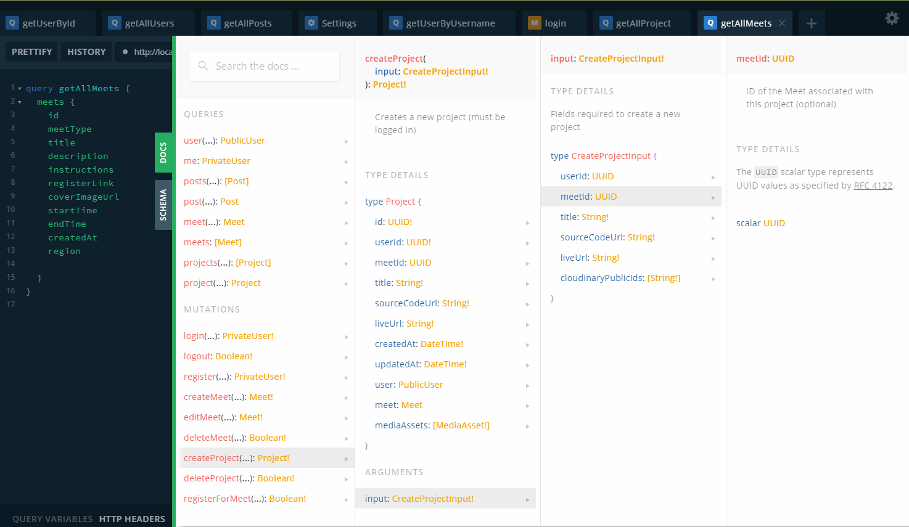

# Mintbean Platform V3 Backend

<!-- TOC auto-generated by Markdown Preview Enchanced VSCode extension-->
<!-- @import "[TOC]" {cmd="toc" depthFrom=2 depthTo=6 orderedList=false} -->

<!-- code_chunk_output -->

- [Installation](#installation)
- [Development](#development)
  - [Setting up the local database](#setting-up-the-local-database)
  - [Making production data dumps](#making-production-data-dumps)
  - [Development workflow](#development-workflow)
    - [Auto-generating TypeScript types](#auto-generating-typescript-types)
    - [Adding new schemas](#adding-new-schemas)
  - [Running tests / TDD workflow](#running-tests-tdd-workflow)
  - [NPM Scripts Reference](#npm-scripts-reference)
  - [Knex CLI Reference](#knex-cli-reference)
- [Deployment](#deployment)
- [Api Reference](#api-reference)
- [Scheduled Jobs](#scheduled-jobs)
- [Features](#features)
  - [Kanban](#kanban)
  - [Email](#email)
  <!-- /code_chunk_output -->

## Installation

```sh
$ yarn install
```

## Development

Local development and tests are configured to use PostgreSQL in a Docker container.

_[Docker](https://docs.docker.com/get-docker/) must be installed and running for any development work._

### Setting up the local database

1. Start the PostgreSQL container with `yarn postgres`. Development roles and databases are automatically created on the initial run.

2. Run `cp .env.development .env` to use default development database variables during development.

3. Run `yarn pristine`, which resets the database and runs the migrations and seeds. You will need to re-run this command when the database schema is changed.
   **Warning: all existing data in the database will be lost!**

- You can access the PostgreSQL CLI with `yarn psql`. All column names that are in camelCase need double quotation marks when used in raw SQL queries (i.e. `SELECT body, "userId" from posts;`).

- If you want to, you can run postgres on your host machine and point to the port (usually 5432) in `.env`. If you do so, **you must configure postgres to use the UTC timezone (by editing `.conf` and restarting the postgres process)!** The docker postgres and most servers use UTC by default so it's not a problem, but your local postgres may be configured in your local timezone. If your postgres is not set to UTC, you will get a nasty bug when editing/creating Meets!

### Making production data dumps

A shell script ` db/pgdump_production.sh` can be executed to make a dump of current production data into a `backups` direction (gitignored).

This operation requires access to the production server.

Note: the script calls `ssh MintbeanV3Production`, meaning you must name your host connection `MintbeanV3Production` in `~/.ssh/config` on your machine

```terminal
Host MintbeanV3Production
    HostName <HOST NAME OMITTED>
    User ubuntu
    IdentityFile ~/.ssh/MintbeanProduction

```

### Development workflow

1. [Setting up the local database](#setting-up-the-local-database)
2. Run `yarn dev` to start a GraphQL endpoint at `localhost:4000/graphql`.
3. Go to `localhost:4000/graphql` to use the GraphQL Playground.

#### Auto-generating TypeScript types

Running `yarn gen-types` auto-generates a TypeScript definition file using `graphql-codegen`. The tool reads the schema file in `./src/graphql/schema.ts` and outputs TypeScript definitions in `./src/graphql/generated/tsTypes.ts`. You may then import types directly from that file, such as:

```ts
 from "./generated/tsTypes";
```

Resolvers are also automatically typed, i.e:

```ts
import { Resolvers } from "../generated/tsTypes";

const postResolver: Resolvers = {
  Query: {
    // Rest of code
  },
};
```

Remember to run `yarn gen-types` after every schema change, to ensure `tsTypes` is up to date and you don't get TS errors. This is unnecessary if you're in hot-reload/watch mode with `yarn dev`, as the generator tool automatically watches for schema changes.

#### Adding new schemas

1. Create the new typeDef file for the entity in `./src/graphql/typedefs/entity.ts`.
2. Run `yarn gen-types` to update the `Resolvers` type in Typescript type so you can take advantage of typing when making the resolver.
3. Create a new resolver file for the entity in `./src/graphql/resolvers/entityResolver.ts`.
4. Add the typedef and resolver into the corresponding array of the schema generator file in `./src/graphql/schema.ts`.

### Running tests / TDD workflow

1. Start the PostgreSQL container with `yarn postgres`. Test roles and databases are automatically created on the initial run.

2. Run `yarn pristine` to set up the test database migrations.

3. Run `yarn test` for a single test with coverage report, or `yarn tdd` to run tests in watch mode as part of a TDD workflow.

### NPM Scripts Reference

| Script        | Description                                                                                                                                                                                                                                                    |
| ------------- | -------------------------------------------------------------------------------------------------------------------------------------------------------------------------------------------------------------------------------------------------------------- |
| `start`       | Starts the server with `ts-node`                                                                                                                                                                                                                               |
| `dev`         | Starts the server with `ts-node` & hot-reload                                                                                                                                                                                                                  |
| `build`       | Builds `*.ts` in `./src` to `*.js` in `./build`                                                                                                                                                                                                                |
| `db:reset`    | Drops and recreates all databases, nuking all the tables                                                                                                                                                                                                       |
| `gen-types`   | See [above](#auto-generating-typescript-types)                                                                                                                                                                                                                 |
| `knex`        | Runs knex cli tools for migration/seeds, using the default database specified in `.env`                                                                                                                                                                        |
| `knex:test`   | Runs knex cli tools for migration/seeds, using the test database (specified in `./test/.env.test`)                                                                                                                                                             |
| `postgres`    | Starts the Postgres docker container                                                                                                                                                                                                                           |
| `pristine`    | Runs `db:reset` then runs all the migrations and seeds on both the dev and test databases.                                                                                                                                                                     |
| `psql`        | Enters the psql CLI in the docker container                                                                                                                                                                                                                    |
| `tdd`         | Runs the tests in watch mode for a TDD workflow                                                                                                                                                                                                                |
| `test`        | Runs the tests once and generates a coverage report                                                                                                                                                                                                            |
| `dump:prod`   | Dumps production backups into `db/backups/*`                                                                                                                                                                                                                   |
| `rollback:db` | Clears knex's cache of past migrations. This is useful when switching between branches with different migrations in development if you encounter corrupt migration error. After rolling back, use `yarn pristine` to build tables with current branch's schema |

### Knex CLI Reference

Prepend commands below with either `yarn knex` to target the default db (specified in `.env`) or `yarn knex:test` to target the test db (specified in `./test/.env.test`).

| Command                  | Description                                                                                       |
| ------------------------ | ------------------------------------------------------------------------------------------------- |
| `migrate:latest`         | Runs all migration files in `./src/db/migrate`                                                    |
| `migrate:rollback --all` | Undos all previous migrations                                                                     |
| `seed:run`               | Runs all the seed files in `./src/db/seeds` in alphabetical order (drops all previous data first) |
| `migrate:make <name>`    | Makes an empty timestamped migration file in `./src/db/migrate`                                   |
| `seed:make <name>`       | Makes an empty seed file in `./src/db/seed`                                                       |

---

## Deployment

1. ssh into prod
2. in home dir, backup the db:
   `sudo -u postgres pg_dumpall --column-inserts > backups/backup.production.\$current_time.sql`
3. cd into backend dir
4. stop backend service
   `pm2 stop "backendv3"`
5. git checkout the appropriate branch
6. git pull
7. `yarn install`
8. `yarn knex migrate:latest`
9. `pm2 start yarn --name "backendv3" -- start`

## Api Reference

1. [Setting up the local database](#setting-up-the-local-database)
2. Run `yarn start`.
3. Navigate to `localhost:4000/graphql` on your browser to use the GraphQL playground (`NODE_ENV` must not be set to `production`).
4. Click `DOCS` tab on the right side to explore the API reference.
   
   <br>
5. Click through the definitions to explore them in more detail:
   

## Scheduled Jobs

Jobs are standalone scripts that can be run via `yarn jobs:<job-name>`.

These scripts can be found in `src/jobs/`. Jobs use a separate `JobContext` to provide access to any constructed entities likes Daos/Services, such that they can run independently of the application itself.

### `yarn jobs:email`

Retrieves all `scheduledEmails` due for sending, builds emails, sends, and logs and handles responses.

It is suggested this job be scheduled to **run every 5 - 10 seconds**, as to provide near-immediate sending of emails queued to be sent "now", like registration confirmations.

Emails that fail sending for whatever reason are left in the queue, with a maximum of 3 retries.

For `scheduledEmails` with mulitple recipients (i.e the `meetRecipientId` field is present), a member email that fails sending is requeued as a single `scheduledEmail` record with a specified single `userRecipientId` and given two retries.

## Features

### Kanban

The kanban is a workflow board with status columns and card items that can be moved between those columns (x dimension) and change order within a column (y dimension). We currently have three available status columns: `TODO`, `WIP` and `DONE`.

There are two important entities to be aware of: `KanbanCanon` and `Kanban`.

**KanbanCanon** is the "master" kanban maintained by an admin, with a title, decscription and master `KanbanCanonCards`

**Kanban** is the individualized view of a kanban for a given user. It contains `kanbanCards` that persist their position after the user has moved them.

`kanbanCards` on a user `kanban` are really just `kanbanCanonCards` resolved under a different name.

The positional data for kanbanCanonCards and kanbanCards are stored as a serialized JSON object in a column called `cardPositions` on the `kanbanCanonCards` and `kanbanSessionCards` tables in the database.

Some utilities in `cardPostionUtils.ts` help to resolve and update `cardPositions` when moving, adding and deleting kanban cards.

In this manner, no positional data is sent on the kanbanCanonCards or kanbanCards themselves, rather as a `cardPositions` object on `kanbanCanon` and `kanban` that reference kanbanCanonCard Ids. The client (ex: frontend) can then map the cards to the positoins in `cardPositions`.


### Email

All application emails are sent via a queue system stored in the `scheduledEmails` table in the database. The queue should be periodically checked (by cron job) for emails that need to be sent, and those emails built and dispatched.

The `scheduledEmails` table provides instructions for how to build an email and resolve it's recipients. Here are the important fields(\* = not nullable):

| id     | templateName | userRecipientId | meetRecipientId | meetId | sendAt      | retriesLeft |
| ------ | ------------ | --------------- | --------------- | ------ | ----------- | ----------- |
| \*UUID | \*text       | UUID            | UUID            | UUID   | \*timestamp | integer     |

`templateName` is a string pointing to the filepath of the `.ejs` templates for this email. `templateName` entry is restricted by Typescript enum `EmailTemplateName`
`userRecipientId` is specified if the email is for a single user (registration confirmations).
`meetRecipientId` is specified if the email is for all registerants of a meet (meet reminders)
`meetId` is the meet that is the topic of the email
`sendAt` is the threshold of when to trigger sending this scheduled email job.
`retriesLeft` number of attempts at sending remaining.

When the `yarn jobs:email` job is fired, all `scheduledEmails` ready for sending (i.e. `sendAt` < now ) are selected via `EmailService#getEmailsToBeSent()` which also builds `EmailContext` by inflating the values in the table, resolving recipients, and building ics calendar attachments if necessary.

Once the `EmailContext` is built, the recipients are looped over to build user-specific templated emails. These templated emails are then sent one by one via `EmailApiDao#send(email)`.

`scheduledEmails` that suceed in sending to one or more recipients are deleted.

Any email that fails sending is either left (in the queue in the case of single recipient `scheduledEmails`), or re-queued as single recipient `scheduledEmails` (in the case of bulk recipient `scheduledEmails`) with 2 retries remaining. They will be attempted again the next time the `yarn jobs:email` is run.

Logging occurs for all email responses (including success). Keep an eye on the server logs to see whether any maintenence is required.

Note: emails that fail 3 times are left in the database and will pool if not maintained. Run checks and clean periodically.

We currently have 2 email flows:

- When user registers for meet, send immediate **registration confirmation** with attached calendar invite
- When a new meet is created, queue **two reminder emails** leading up to meet startTime (1: start-24hrs, 2: start-30mins)
  \*Warning! meet reminders are currently not updated if meetTime changes. TODO.

Calendar invites for hackathons are scheduled as a 1 hour Kickoff from `startTime` instead of blocking 7 whole days of a user's calendar.
